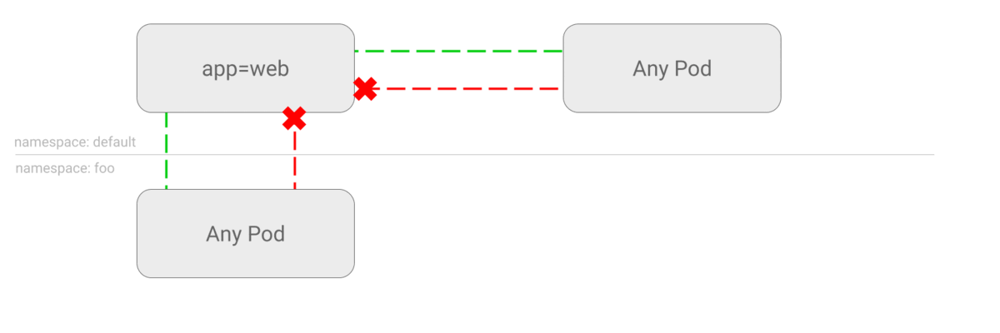

# DENY all traffic to an application

This NetworkPolicy will drop all traffic to pods of an
application, selected using Pod Selectors.

**Use Cases:**
- It’s very common: To start whitelisting the traffic using
  Network Policies, first you need to blacklist the traffic
  using this policy.
- You want to run a Pod and want to prevent any other Pods
  communicating with it.
- You temporarily want to isolate traffic to a Service from
  other Pods.


### Example

Run a nginx Pod with labels `app=web`  and expose it at port 80:

    kubectl run --generator=run-pod/v1 web --image=nginx --labels app=web --expose --port 80

Run a temporary Pod and make a request to `web` Service:

    $ kubectl run --generator=run-pod/v1 --rm -i -t --image=alpine test-$RANDOM -- sh
    / # wget -qO- http://web
    <!DOCTYPE html>
    <html>
    <head>
    ...

It works, now save the following manifest to `web-deny-all.yaml`,
then apply to the cluster:

```yaml
kind: NetworkPolicy
apiVersion: networking.k8s.io/v1
metadata:
  name: web-deny-all
spec:
  podSelector:
    matchLabels:
      app: web
  ingress: []
```

```sh
$ kubectl apply -f web-deny-all.yaml
networkpolicy "web-deny-all" created
```

## Try it out

Run a test container again, and try to query web:

    $ kubectl run --generator=run-pod/v1 --rm -i -t --image=alpine test-$RANDOM -- sh
    / # wget -qO- --timeout=2 http://web
    wget: download timed out

Traffic dropped!

-----

### Remarks

In the manifest above, we target Pods with `app=web` label to police the
network. This manifest file is missing the `spec.ingress` field. Therefore it is
not allowing any traffic into the Pod.

If you create another NetworkPolicy that gives some Pods access to this
application directly or indirectly, this NetworkPolicy will be obsolete.

If there is at least one NetworkPolicy with a rule allowing the traffic, it
means the traffic will be routed to the pod regardless of the policies blocking
the traffic.

### Cleanup

```sh
kubectl delete pod web
kubectl delete service web
kubectl delete networkpolicy web-deny-all
```
