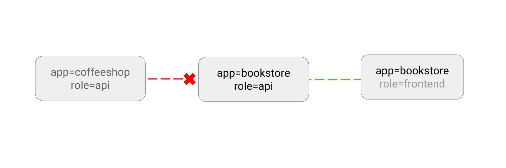

# LIMIT traffic to an application

You can create Networking Policies allowing traffic from only
certain Pods.

**Use Case:**
- Restrict traffic to a service only to other microservices that need
  to use it.
- Restrict connections to a database only to the application using it.



### Example

Suppose your application is a REST API server, marked with labels `app=bookstore` and `role=api`:

    kubectl run apiserver --image=nginx --labels app=bookstore,role=api --expose --port 80

Save the following NetworkPolicy to `api-allow.yaml` to restrict the access
only to other pods (e.g. other microservices) running with label `app=bookstore`:

```yaml
kind: NetworkPolicy
apiVersion: networking.k8s.io/v1
metadata:
  name: api-allow
spec:
  podSelector:
    matchLabels:
      app: bookstore
      role: api
  ingress:
  - from:
      - podSelector:
          matchLabels:
            app: bookstore
```

```sh
$ kubectl apply -f api-allow.yaml
networkpolicy "api-allow" created
```

### Try it out

Test the Network Policy is **blocking** the traffic, by running a Pod without the `app=bookstore` label:

    $ kubectl run test-$RANDOM --rm -i -t --image=alpine -- sh
    / # wget -qO- --timeout=2 http://apiserver
    wget: download timed out

Traffic is blocked!

Test the Network Policy is **allowing** the traffic, by running a Pod with the `app=bookstore` label:

    $ kubectl run test-$RANDOM --rm -i -t --image=alpine --labels app=bookstore,role=frontend -- sh
    / # wget -qO- --timeout=2 http://apiserver
    <!DOCTYPE html>
    <html><head>

Traffic is allowed.

### Cleanup

```
kubectl delete deployment apiserver
kubectl delete service apiserver
kubectl delete networkpolicy api-allow
```
