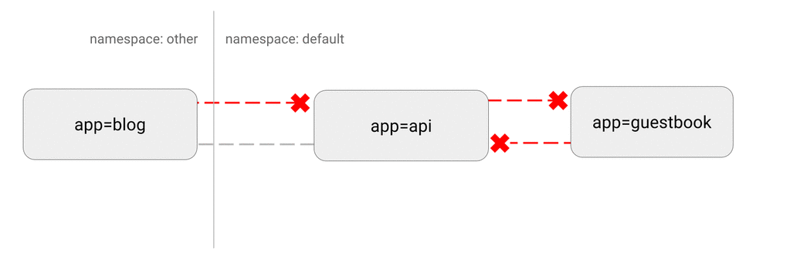

# DENY all non-whitelisted traffic to a namespace

💡 **Use Case:** This is a fundamental policy, blocking all cross-pod networking other
than the ones whitelisted via the other Network Policies you deploy.

Consider applying this manifest to any namespace you deploy
workloads to (anything but `kube-system`).

💡 **Best Practice:**  This policy will give you a default "deny all" functionality.
This way, you can clearly identify which components have dependency on
which components and deploy Network Policies which can be translated to dependency
graphs between components.



## Manifest

```yaml
kind: NetworkPolicy
apiVersion: networking.k8s.io/v1
metadata:
  name: default-deny-all
  namespace: default
spec:
  podSelector: {}
  ingress: []
```

Note a few things about this manifest:

- `namespace: default` deploy this policy to the `default` namespace.
- `podSelector:` is empty, this means it will match all the pods. Therefore,
  the policy will be enforced to ALL pods in the `default` namespace .
- There are no `ingress` rules specified. This causes incoming traffic to be
  dropped to the selected (=all) pods.
  - In this case, you can just omit the `ingress` field, or leave it empty
    like `ingress:`

Save this manifest to `default-deny-all.yaml` and apply:

```sh
$ kubectl apply -f default-deny-all.yaml
networkpolicy "default-deny-all" created
```

### Cleanup

    kubectl delete networkpolicy default-deny-all
