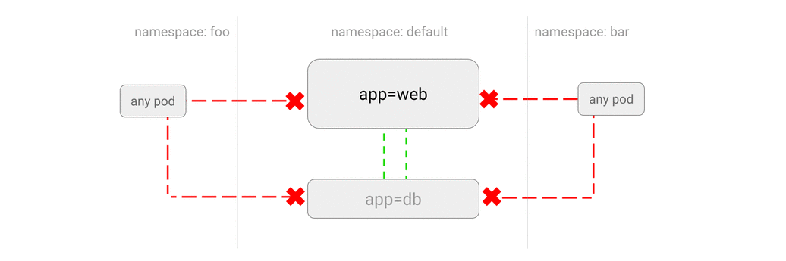

## DENY all traffic from other namespaces

__(_a.k.a  LIMIT access to the current namespace_)__

You can configure a NetworkPolicy to **deny all the traffic from other
namespaces while allowing all the traffic coming from the same namespace** the
pod deployed to.

**Use Cases**
- You do not want deployments in `test` namespace to accidentally
  send traffic to other services or databases in `prod` namespace.
- You host applications from different customers in separate Kubernetes
  namespaces and you would like to block traffic coming from outside a
  namespace.



### Example

Start a web service in namespace default:

```sh
$ kubectl run web --namespace=default --image=nginx --labels="app=web" --expose --port=80
```

Save the following manifest to `deny-from-other-namespaces.yaml` and apply
to the cluster:

```yaml
kind: NetworkPolicy
apiVersion: networking.k8s.io/v1
metadata:
  namespace: default
  name: deny-from-other-namespaces
spec:
  podSelector:
    matchLabels:
  ingress:
  - from:
    - podSelector: {}
```

```sh
$ kubectl apply -f deny-from-other-namespaces.yaml
networkpolicy "deny-from-other-namespaces" created"
```

Note a few things about this manifest:

- `namespace: default` deploys it to the `default` namespace.
- it applies the policy to ALL pods in `default` namespace as the
  `spec.podSelector.matchLabels` is empty and therefore selects all pods.
- it allows traffic from ALL pods in the `default` namespace, as
   `spec.ingress.from.podSelector` is empty and therefore selects all pods.

## Try it out

Query this web service from the `foo` namespace:

```sh
$ kubectl create namespace foo
$ kubectl run test-$RANDOM --namespace=foo --rm -i -t --image=alpine -- sh
/ # wget -qO- --timeout=2 http://web.default
wget: download timed out
```

It blocks the traffic from `foo` namespace!

Any pod in `default` namespace should work fine:

```sh
$ kubectl run test-$RANDOM --namespace=default --rm -i -t --image=alpine -- sh
/ # wget -qO- --timeout=2 http://web.default
<!DOCTYPE html>
<html>
```

### Cleanup

```sh
$ kubectl delete pod web -n default
$ kubectl delete service web -n default
$ kubectl delete networkpolicy deny-from-other-namespaces -n default
$ kubectl delete namespace foo
```
