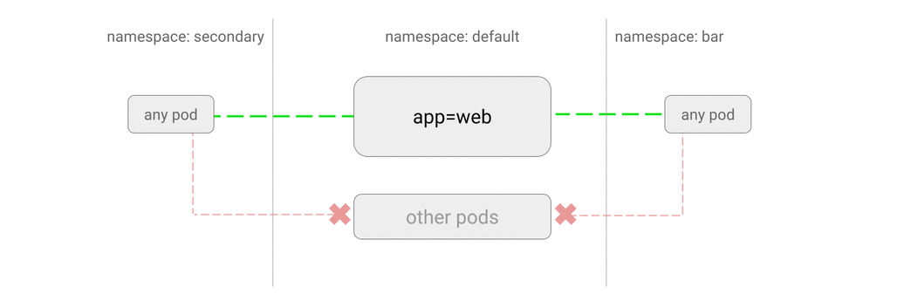

# ALLOW traffic to an application from all namespaces

This NetworkPolicy will allow traffic from all pods in all namespaces
to a particular application.

**Use Case:**
- You have a common service or a database which is used by deployments in
  different namespaces.

You do not need this policy unless there is already a NetworkPolicy [blocking traffic
to the application](01-deny-all-traffic-to-an-application.md) or a NetworkPolicy [blocking
non-whitelisted traffic to all pods in the namespace](03-deny-all-non-whitelisted-traffic-in-the-namespace.md).



### Example

Create a new namespace called `secondary` and start a web service:

```sh
kubectl create namespace secondary

kubectl run web --image=nginx \
    --namespace secondary \
    --labels=app=web --expose --port 80
```

Save the following manifest to `web-allow-all-namespaces.yaml` and apply
to the cluster:

```yaml
kind: NetworkPolicy
apiVersion: networking.k8s.io/v1
metadata:
  namespace: secondary
  name: web-allow-all-namespaces
spec:
  podSelector:
    matchLabels:
      app: web
  ingress:
  - from:
    - namespaceSelector: {}
```

```sh
$ kubectl apply -f web-allow-all-namespaces.yaml
networkpolicy "web-allow-all-namespaces" created"
```

Note a few things about this NetworkPolicy manifest:

- Applies the policy only to `app:web` pods in `secondary` namespace.
- Selects all pods in all namespaces (`namespaceSelector: {}`).
- By default, if you omit specifying a `namespaceSelector` it does not select
  any namespaces, which means it will allow traffic only from the namespace
  the NetworkPolicy is deployed to.

> Note: Dropping all selectors from the `spec.ingress.from` item has the same
> effect of matching all pods in all namespaces. e.g.:
>
>     ...
>        ingress:
>          - from:
>
> However, prefer the syntax in the full manifest clear expression of intent.


### Try it out

Query this web service from the `default` namespace:

```sh
$ kubectl run test-$RANDOM --namespace=default --rm -i -t --image=alpine -- sh
/ # wget -qO- --timeout=2 http://web.secondary
<!DOCTYPE html>
<html>
<head>
```

Similarly, it also works if you query it from any pod deployed to `secondary`.

### Cleanup

    kubectl delete deployment web -n secondary
    kubectl delete service web -n secondary
    kubectl delete networkpolicy web-allow-all-namespaces -n secondary
    kubectl delete namespace secondary
