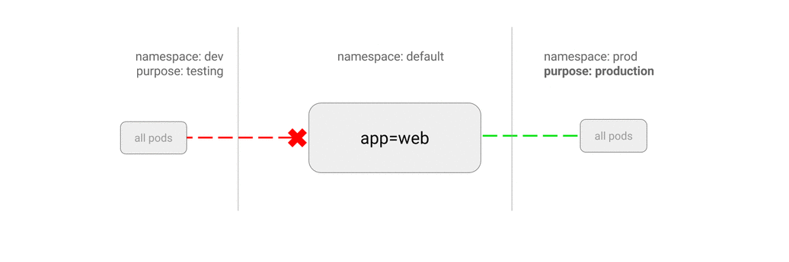

# ALLOW all traffic from a namespace

This policy is similar to [allowing traffic from all
namespaces](05-allow-traffic-from-all-namespaces.md) but shows how you can
choose particular namespaces.

**Use Case:**
- Restrict traffic to a production database only to namespaces where production
  workloads are deployed.
- Enable monitoring tools deployed to a particular namespace to scrape metrics
  from the current namespace.



### Example

Run a web server in the `default` namespace:

    kubectl run web --image=nginx \
        --labels=app=web --expose --port 80

Now, suppose you have these three namespaces:

- `default`: (installed by Kubernetes) This is where your API is deployed.
- `prod`: Other production workloads run here. This has label `purpose=prod`.
- `dev`: This is your dev/test area. This has label `purpose=testing`.

Create the `prod` and `dev` namespaces:

```sh
kubectl create namespace dev
kubectl label namespace/dev purpose=testing
```

```sh
kubectl create namespace prod
kubectl label namespace/prod purpose=production
```

The following manifest restricts traffic to only pods in namespaces
that has label `purpose=production`. Save it to `web-allow-prod.yaml`
and apply to the cluster:

```yaml
kind: NetworkPolicy
apiVersion: networking.k8s.io/v1
metadata:
  name: web-allow-prod
spec:
  podSelector:
    matchLabels:
      app: web
  ingress:
  - from:
    - namespaceSelector:
        matchLabels:
          purpose: production
```

```sh
$ kubectl apply -f web-allow-prod.yaml
networkpolicy "web-allow-prod" created
```

### Try it out

Query this web server from `dev` namespace, observe it is blocked:

```sh
$ kubectl run test-$RANDOM --namespace=dev --rm -i -t --image=alpine -- sh
If you don't see a command prompt, try pressing enter.
/ # wget -qO- --timeout=2 http://web.default
wget: download timed out

(traffic blocked)
```

Query it from `prod` namespace, observe it is allowed:

```sh
$ kubectl run test-$RANDOM --namespace=prod --rm -i -t --image=alpine -- sh
If you don't see a command prompt, try pressing enter.
/ # wget -qO- --timeout=2 http://web.default
<!DOCTYPE html>
<html>
<head>
...
(traffic allowed)
```

### Cleanup

    kubectl delete networkpolicy web-allow-prod
    kubectl delete deployment web
    kubectl delete service web
    kubectl delete namespace {prod,dev}
