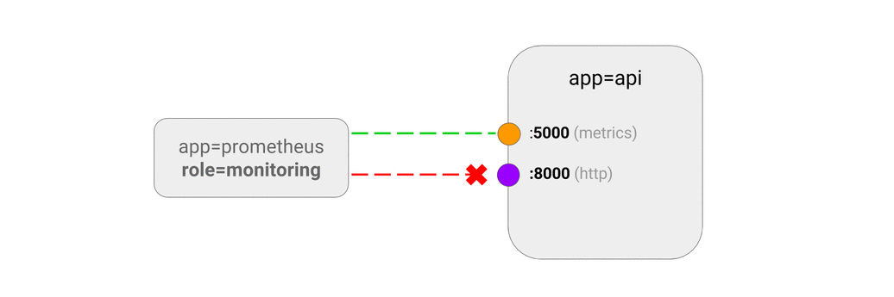

# ALLOW traffic only to a port of an application

This NetworkPolicy lets you define ingress rules for specific ports
of an application. If you do not specify a port in the
ingress rules, the rule applies to all ports.

A port may be either a numerical or named port on a pod.

**Use Cases**
- Allow monitoring system to collect the metrics by querying the diagnostics
  port of your application, without giving it access to the rest of the
  application.



### Example

Run a web server deployment called `apiserver`:

    kubectl run apiserver --image=ahmet/app-on-two-ports --labels=app=apiserver

This application returns a hello response to requests on `http://:8000/`
and a monitoring metrics response on `http://:5000/metrics`.

Expose the deployment as Service, map 8000 to 8001, map 5000 to 5001.

    kubectl create service clusterip apiserver \
        --tcp 8001:8000 \
        --tcp 5001:5000

>  **NOTE:**
> Network Policies will not know the port numbers you exposed the application,
> such as 8001 and 5001. This is because they control inter-pod traffic and
> when you expose Pod as Service, ports are remapped like above. Therefore,
> you need to use the container port numbers (such as 8000 and 5000) in the 
> NetworkPolicy specification.
> An alternative less error prone is to refer to the port names (such as `metrics` and `http`).

Save this Network Policy as `api-allow-5000.yaml` and apply to
the cluster.
  
```yaml
kind: NetworkPolicy
apiVersion: networking.k8s.io/v1
metadata:
  name: api-allow-5000
spec:
  podSelector:
    matchLabels:
      app: apiserver
  ingress:
  - ports:
    - port: 5000
    from:
    - podSelector:
        matchLabels:
          role: monitoring
```

```sh
$ kubectl apply -f api-allow-5000.yaml
networkpolicy "api-allow-5000" created
```

This network policy will:

- Drop all non-whitelisted traffic to `app=apiserver`.
- Allow traffic on port `5000` from pods with label
  `role=monitoring` in the same namespace.

### Try it out

Run a pod with no custom labels, observe the traffic to ports
5000 and 8000 are blocked:

```sh
$ kubectl run test-$RANDOM --rm -i -t --image=alpine -- sh
/ # wget -qO- --timeout=2 http://apiserver:8001
wget: download timed out

/ # wget -qO- --timeout=2 http://apiserver:5001/metrics
wget: download timed out
```

Run a pod with `role=monitoring` label, observe the traffic to
port 5000 is allowed, but port 8000 is still not accessible:


```sh
$ kubectl run test-$RANDOM --labels=role=monitoring --rm -i -t --image=alpine -- sh 
/ # wget -qO- --timeout=2 http://apiserver:8001
wget: download timed out

/ # wget -qO- --timeout=2 http://apiserver:5001/metrics
http.requests=3
go.goroutines=5
go.cpus=1
```

### Cleanup

    kubectl delete deployment apiserver
    kubectl delete service apiserver
    kubectl delete networkpolicy api-allow-5000
